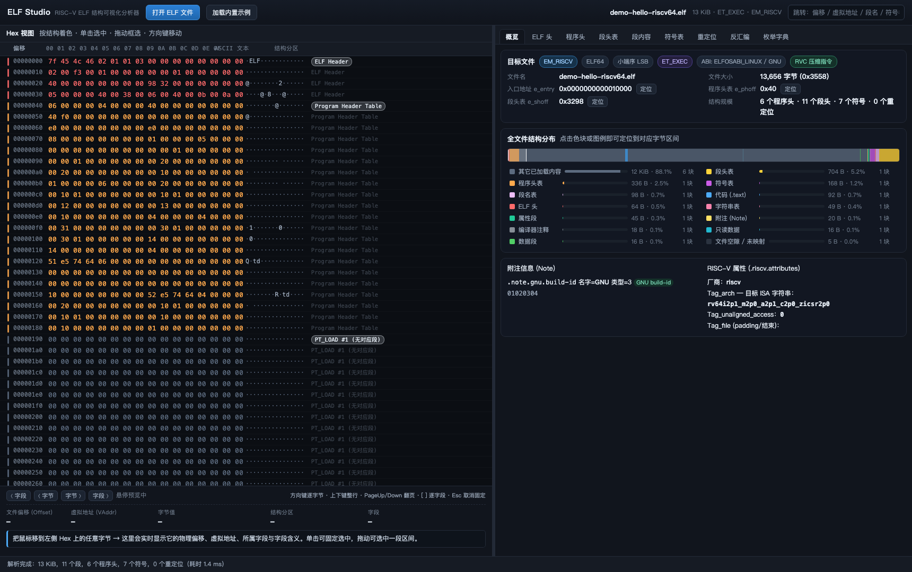
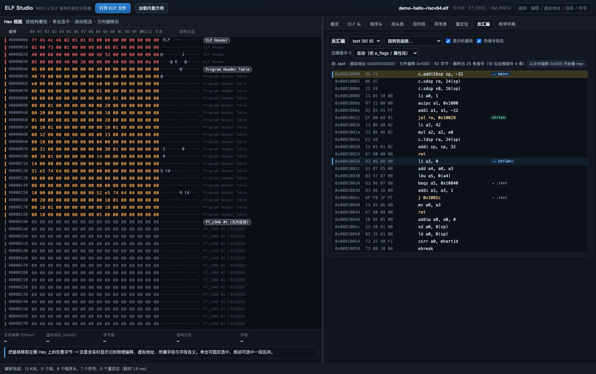
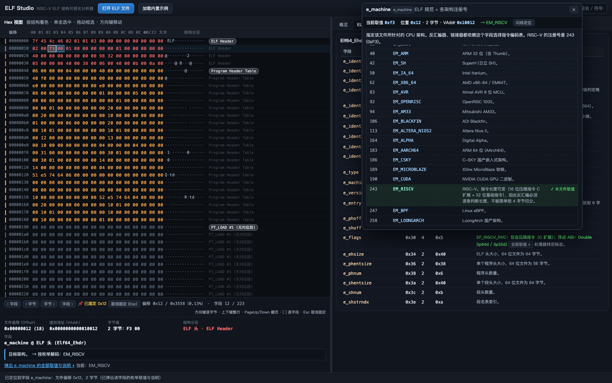
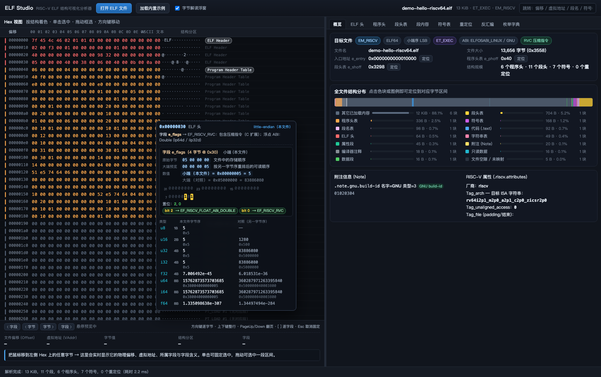
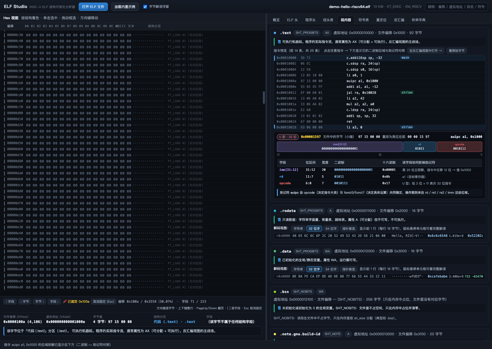
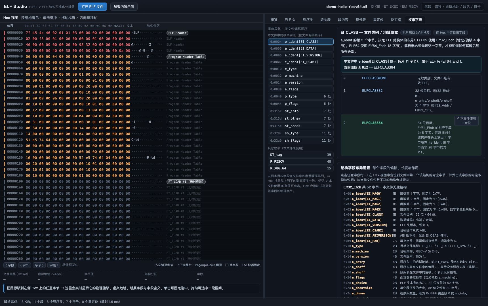

# ELF Studio — RISC-V ELF 结构可视化分析器

一个**纯前端、零依赖、单文件**的 ELF 分析工具：把本地 ELF 文件拖进浏览器，即可逐字节理解它的物理结构。
面向 RISC-V 优化（RV32/RV64 I/M/A/F/D + 压缩指令 C + 常用 Zba/Zbb/Zbs 位操作扩展），同时支持 x86-64。

> **在线使用：<https://gpthimble.github.io/elf-studio/>** 　·　仓库：<https://github.com/gpthimble/elf-studio>

## 直接使用（三种方式，任选其一）

1. **在线使用**：打开 <https://gpthimble.github.io/elf-studio/>（由本仓库的 GitHub Pages 提供；静态托管只负责把页面发给你，ELF 文件始终在浏览器本地解析，不会上传到任何服务器）。
2. **离线使用**：下载仓库中的 `elf-studio.html`（或 `index.html`），**双击即可**——无需服务器、无需安装、不联网。
3. **本地构建**：`python3 build.py` 会把 `src/` 打包成同一个单文件产物。

---

## 界面预览

| 概览：结构分布与配色 | 反汇编与视窗联动 |
| --- | --- |
|  |  |

| 字段枚举弹出面板 | 字节序转换与位图 |
| --- | --- |
|  |  |

| 段内容 + 指令位域对照 | 字典按文件偏移排序 |
| --- | --- |
|  |  |

---

## 一、功能与需求对照

| 需求 | 实现情况 |
| --- | --- |
| **本地文件加载与读取** | 拖拽到窗口任意位置，或点击「打开 ELF 文件」。用 `File.arrayBuffer()` 在前端一次性读入 `Uint8Array`，随后全部解析都在浏览器内完成（无上传、无网络请求）。另有「加载内置示例」可零准备体验全部功能。 |
| **多色块 Hex 视图** | 按 ELF **物理结构**逐字节着色：ELF 头、程序头表、段头表、`.text`、`.rodata`、`.data`、`.bss`、符号表、字符串表、重定位表、`.dynamic`、Note、调试段、PLT/GOT、属性段、文件空隙等各有专属配色。每行左侧有结构色条，段落起点处直接标出结构名。 |
| **视窗联动与自动定位** | 右侧任意表格（ELF 头字段、程序头条目、段头、符号、重定位、反汇编行）被点击时，左侧 Hex 会自动滚动到对应文件偏移、框选字节并闪烁高亮；反向地，在 Hex 里选中字节时，反汇编视图中对应的指令行也会高亮。顶部「跳转」框支持 偏移 / 虚拟地址 / 段名 / 符号名。 |
| **字节级元数据探针** | 悬停任意字节，底部探针条实时显示：**物理文件偏移（hex + 十进制）、虚拟地址（含来源段/程序头）、字节值（hex/十进制/二进制/字符）、结构分区、字段名与字段说明**，若该字段是枚举还会即时解码（例如 `e_machine` → `EM_RISCV`）。单击可固定，拖动可框选一段字节。 |
| **枚举全量字典与字段详解** | 19 组枚举、300+ 个取值，每条都标注 **规范出处 + 取值 + 原理说明**：`EI_CLASS/EI_DATA/EI_OSABI`、`e_type`、`e_machine`、`e_version`、`p_type`、`p_flags`、`sh_type`、`sh_flags`、`st_bind/st_type`（`st_info` 的两个子字段，单独成表）、`st_other`、`st_shndx`、`DT_*`、`R_RISCV_*`、`R_X86_64_*`、RISC-V `e_flags`（含浮点 ABI / RVC / RVE / TSO 子字段解码）。**点击任意字段行 → 就地弹出该字段的全部可选取值、当前值与说明**，不跳转页面、不打断浏览节奏；弹出面板会把当前取值高亮并自动滚到眼前。另附 `Elf32/64_Ehdr、Phdr、Shdr、Sym、Rela` 的结构布局速查表（每个字段的偏移、长度、作用，可点击定位）。 |
| **代码段指令反编译** | 提取带 `SHF_EXECINSTR` 的段并做线性扫描反汇编。RISC-V 解码器覆盖 RV32/RV64 的 I/M/A/F/D 扩展、压缩指令 C、Zicsr/Zifencei，以及常用 Zba/Zbb/Zbs/Zbc；自动识别伪指令别名（`li/mv/ret/jr/j/nop/beqz/bnez/csrr`）；跳转/分支目标若命中符号表会直接标注函数名；可切换「显示机器码 / 伪指令别名 / 压缩指令解析策略」。x86-64 使用简化解码器，覆盖常见整数与 SSE 指令。 |
| **符号表解析与函数定位** | 解析 `.symtab` 与 `.dynsym`（名称、`st_value`、`st_size`、绑定、类型、可见性、所属段、**映射到的文件偏移**），支持按名称/地址搜索与按类型、绑定、所属表过滤。点击任意符号 → Hex 定位到其物理字节；函数符号额外提供「反汇编」按钮，直接跳到该函数入口并对齐视图。 |

### 额外加入的实用能力

- **逐位 / 逐字段浏览**：探针上有一排导航按钮，键盘也能全程操作——
  `←/→` 逐个字节、`↑/↓` 整行（16 字节）、`PageUp/PageDown` 翻页、`Home/End` 跳到文件首尾、
  `[` `]` 在**结构字段**之间前后跳转（遍历 ELF 头、程序头、段头、符号表、重定位、`.dynamic` 的每一个字段）。
  探针会显示「偏移 x / 文件大小（百分比）」与「字段 i / N」的进度，因此可以确定「我已经浏览到哪里、还剩多少」。
- **点选即固定（Pin）**：在 Hex 上单击或拖选、或点击任意字段行，探针内容会被固定（📌），鼠标移开也不会丢；
  按 `Esc` 或点「取消固定」恢复悬停预览模式。
- **悬停整段高亮**：悬停字段行、符号行、反汇编行时，高亮的是该条目对应的**整段字节**（而不是一个字节），
  移开后立即清除，不会残留。
- **全文件结构分布条**：整份文件按结构着色的缩略图，叠加当前视窗位置指示框，悬停显示区间，点击即跳转。
- **段用途词典**：`.text/.plt/.got/.bss/.rela.text/.riscv.attributes/.debug_line` 等 40+ 常见段的「它是什么、谁用它、为什么这样设计」说明，随段头/段内容面板展示。
- **`.riscv.attributes` 解析**：ULEB128 解码属性段，直观显示 ISA 字符串（如 `rv64i2p1_m2p0_a2p1_c2p0_zicsr2p0`）、栈对齐、原子性 ABI 等。
- **`.note.*` 解析**：例如 GNU build-id 的十六进制内容。
- **校验与容错**：魔数、`EI_CLASS/EI_DATA`、`e_ehsize`、越界偏移、超长段等都会给出明确提示；非 ELF 文件会被明确拒绝并说明原因。
- **可拖拽分栏**：拖动中间分隔条，调整 Hex 视图与结构面板的宽度比例。
- **键盘导航**：Hex 视图中支持方向键、PageUp/PageDown、Home/End 逐字节浏览；`⌘O / Ctrl+O` 打开文件。
- **字典按文件偏移排序**：字典左侧不是按主题罗列的枚举清单，而是**按字段在文件中出现的字节顺序**组织
  （`0x0004 e_ident[EI_CLASS]` → `0x0012 e_machine` → `0x0040 p_type` → … → `0x32a0 sh_flags`），
  与 Hex 视图从上到下的阅读顺序一致；每一项都带当前值、所在结构、出现次数，并可一键定位到物理字节。
- **字节序解读浮窗**：悬停 Hex 任意字节，就近浮出该「字节组」的完整对照视图——
  ① **原始字节**（文件中的存储顺序，如 `05 00 00 00`）；
  ② **大端预览**（按另一字节序重排后的可读顺序，`00 00 00 05`），用于把「文件里看到的字节」和「字典里的数值」对上号；
  ③ **两种字节序的数值**（十进制 + 十六进制，64 位用 BigInt 精确）；
  ④ **二进制位图**（每 8 位一组、标注位号，置位高亮）与置位 bit 列表；
  ⑤ 每个置位 bit 对应的**枚举项名称**（仅被多比特掩码覆盖的位会额外标注所属掩码）；
  ⑥ 该位置开始的 C 字符串预览，以及 `u8/u16/u32/i32/f32/u64/i64/f64` 的逐类型对照表。
  有字段归属时，字节组自动按**字段边界**取整（例如悬停 `e_flags` 任一个字节都会按整个 4 字节成组）。
  鼠标移到某一行还会在 Hex 中高亮该行对应的那几个字节。顶部「字节解读浮窗」开关可随时关闭（选择会被记住）。
  点击字段弹出的枚举面板里同样带有这个字节/位对照块，方便一边看取值一边看位。
- **段内容即内容 + 内容解码面板**：段内容选项卡按段的性质给出对应的解码视图——
  · **`.text`（以及反汇编视图）**：列出反汇编指令与符号标注，**点击任意指令 → 下方展开「二进制 ↔ 助记符」对照面板**：
    位域色块条（opcode / funct3 / rd / rs1 / imm…按规范位区间切分并着色）、位号标尺、字段表（位区间、宽度、二进制、十六进制、该字段如何影响助记符），
    并说明这条助记符是由哪些位组合出来的。压缩指令按 C 扩展格式拆解（funct3/op/imm 位域）。
  · **`.symtab/.dynsym`**：符号表项解码表——每行的原始 16/24 字节与 `st_name`（还原成符号名）、`st_info`（拆成 bind/type）、
    `st_other`（可见性）、`st_shndx`（段名）、`st_value`、`st_size` 逐列对照。
  · **`.rodata/.data/.bss` 等数据段**：内容解码面板，四种视图可切换——
    **字符串**（扫描可打印串，点击定位）、**32 位字**、**64 位字**（每行 16 字节，逐字给出十六进制、十进制、`f32/f64` 浮点解读，
    并自动识别**指针候选**：值落在已映射段内时显示 `→ .text+0x20 main`）、**指针候选**（列出所有指向段内的值）。
  · **`.strtab/.dynstr`**：字符串列表；**`.rela.*`**：重定位项；**`.dynamic`**：DT 标签与取值；**`.note.*`**、**.riscv.attributes** 就地解析。
- **符号双重定位**：符号表每一行有两个跳转按钮——「表项」跳到该符号在 `.symtab/.dynsym` 中那一行表项自身的物理字节，
  「内容」跳到 st_value 换算出的段内字节；函数符号再多一个「反汇编」直达函数入口。
- **虚拟滚动**：只渲染可视窗口内的行（约 60 行），十几万行的大文件滚动依然流畅。

---

## 二、目录结构

```
elf-studio.html          ← 构建产物：单文件应用，双击即用
build.py                 ← 打包脚本（把 src/ 拼成 elf-studio.html）
src/
  shell.html             HTML 骨架
  style.css              深色主题样式（结构配色即定义在这里）
  util.js                纯工具函数（hx / fmtSize / esc ...）
  elf-const.js           ELF 规范常量、枚举字典、字段文档、段用途词典
  elf-enums.js           枚举取值解码（纯函数，可单测）
  elf-parse.js           ELF 解析器（头部 / 段 / 程序头 / 符号 / 重定位 / Note / 属性）
  disasm-riscv.js        RISC-V 反汇编引擎
  disasm-x86.js          x86 / x86-64 反汇编引擎（常用子集）
  hexview.js             多色块 Hex 视图（虚拟滚动 + 选区内联高亮）
  app-core.js            状态、文件加载、联动、字节探针、概览面板
  app-panels.js          ELF 头 / 程序头 / 段头 / 段内容 / 符号 / 重定位 / 字典面板
  app-encoding.js        指令位域对照面板（二进制 ↔ 助记符）
  app-disasm.js          反汇编视图与联动高亮
test/
  make_fixture.py        生成测试夹具（手工构造的 RISC-V ELF + clang 交叉编译的 x86-64 ELF）
  run_tests.js           测试运行器（在 Deno 中执行浏览器脚本）
  tests.js               375 项断言
  syntax_check.js        语法检查 + HTML/JS 的 id 引用一致性检查
  run_all.sh             一键跑完全部验证并重新构建
  fixtures/              生成的二进制夹具
```

重新构建：`python3 build.py`（会把示例 ELF 以 base64 内嵌进产物，便于零依赖试用）。

---

## 三、如何验证它是对的

没有 RISC-V 工具链的环境下，本项目用三种互相独立的手段交叉验证：

1. **RISC-V 解码器 × 权威编码向量**
   `test/tests.js` 中列出手工核对的规范编码（如 `00100513` = `li a0,1`、`8082` = `ret`、`ff010113` = `addi sp,sp,-16`、`f1402573` = `csrr a0,mhartid` 等），逐条与解码器输出比对。

2. **ELF 解析器 × 手工按规范拼装的 ELF**
   `test/make_fixture.py` 按 System V ABI 逐字节构造 ELF32/ELF64 夹具（含程序头、段头、符号表、字符串表、Note、`.riscv.attributes`），测试断言头部字段、段名解析、符号绑定/类型/段归属、偏移↔虚拟地址映射、分区覆盖完整性（不重不漏地覆盖整个文件）等。同一份 `.text` 由 Python 侧编码、由 JS 侧解码，两侧独立实现，任何字段抽取错误都会暴露成文本不一致。

3. **x86 解码器 × 真实编译器产物（LLVM 金标准）**
   `make_fixture.py` 用本机 `clang -target x86_64-unknown-linux-gnu -c` 编译出真实的 ELF 目标文件，并用 `llvm-objdump` 记录每条指令的地址；测试逐条比对**指令边界**是否与 LLVM 完全一致（变长编码下这是最关键的正确性指标）。当前结果：**完全一致**。

运行全部验证：

```sh
sh test/run_all.sh
# 或分别执行
python3 test/make_fixture.py
deno run --allow-read test/run_tests.js     # 375 项断言
deno run --allow-read test/syntax_check.js  # 语法 + id 引用检查
```

夹具一览：`hello-riscv64.elf` / `hello-riscv32.elf`（44 字节级精细构造的小程序）、
`big-riscv64.elf`（47 个段、406 个符号、36 条重定位、200 个函数、26 KB 代码，用于性能与滚动压力测试）、
`x86-64-sample.o`（真实 clang 产物，ET_REL 无程序头）。

---

## 四、实现要点

**解析模型**：`parseELF()` 一次遍历产出三套数据——结构体（头部/段/符号/重定位/Note/属性）、
**颜色分区表** `regions`（有序、首尾相接、完整覆盖文件）、以及**字节标注表** `annotations`
（把 `e_machine`、`p_offset`、`sh_flags`、`st_info` 这类字段映射到具体的 `[start, end)` 字节区间）。
探针只需查标注表即可回答「这个字节是什么」。

**分区仲裁**：段表、程序头、头部区域可能互相重叠（例如 `PT_LOAD` 覆盖了 `.text` 与文件填充）。
实现时给每类结构设定优先级，再做一次「扫描线」裁决：高优先级分区会在自身起点处截断低优先级分区的可见范围，
从而保证既不重复也不遗漏，且最具体的结构（如 `.text`）总是覆盖最宽泛的结构（如整段 `PT_LOAD`）。

**Hex 视图**：固定行高 + 绝对定位 + `translateY`，只渲染可视行；逐字节着色靠一张与文件等长的
`Uint8Array`（1 字节/字节）；选中/高亮状态不重建 DOM，仅对可见节点做 class 增删。

**RISC-V 解码**：先看低 2 位判断 16/32 位，再按 opcode 分派；立即数抽取严格按规范的位域编号实现
（B/J/S 型的散落位域是常见出错点，测试里专门覆盖）。若文件未声明 `EF_RISCV_RVC`，会把 16 位指令
如实显示为 `.2byte` 数据并给出提示，也允许在设置中强制开启解析。

---

## 五、已知限制

- x86/x86-64 解码器为**工程性简化实现**：覆盖常见整数指令、常用 SSE 与多字节 NOP，指令长度可靠
  （已与 LLVM 逐条比对），但浮点/AVX 等复杂编码可能显示为 `.byte` 序列。
- 暂不支持 ARM / AArch64 / MIPS 的指令解码（这些文件仍可完整查看结构与 Hex）。
- 不做 DWARF 语义解析（`.debug_info/.debug_line` 只按段展示与配色）；不构建控制流图，
  反汇编采用线性扫描，因此把数据混排进代码段时可能把数据当成指令。
- 未解析 `.gnu.hash` / SysV `.hash` 的桶内容与符号版本表（`.gnu.version*`）的语义。
- 大文件（>100 MB）在浏览器内存与分区数组上会吃紧，建议先 `objcopy --only-keep-debug` 或裁剪。

## 六、可继续扩展的方向

函数调用图与控制流可视化、DWARF 行号表反向映射（源码行 ↔ 指令）、
RISC-V 反汇编的递归遍历（区分代码与内联数据）、符号版本与哈希表解析、
节区差异对比（两个 ELF 的段级 diff）。
